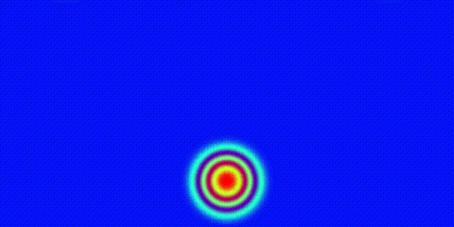

# A fluid dynamics simulation: evolution of a thermal blob

*Authors* Pedde, Veraldi, Zhaokun
*Date* November 2025

This programme simulates the evolution of a thermal bubble (vapour in dry air) driven by a potential temperature 
difference relative to the background.It operates on a fixed 2D grid ($n_x, n_z$). The simulation duration and output 
interval can be set to defaults or defined externally using a Fortran namelist (input.nml) implemented as shown below:

```text
&input_params
  sim_time = 5000.0
  output_freq = 50.0
/
```

in order to execute the program so you can do:
```commandline
./model.x <input.nml>
```
in case of running in parallel
```commandline
mpirun -np <np> ./model.x <input.nml>
```
in slurm script
```commandline
srun ./model.x <input.nml>
```

at the end of the simulation, in the terminal will be printed the results of ``delta mass`` and ``delta energy`` in
order to check the convergence. Also, you will find a ``output.nc`` file containing the results. 
Example of output:

```text
SIMPLE ATMOSPHERIC MODEL STARTING.
 INITIALIZING MODEL STATUS.
 nx         :           100
 nz         :            50
 dx         :     200.0000000000000     
 dz         :     200.0000000000000     
 dt         :    0.6666666666666666     
 final time :     1000.000000000000     
 MODEL STATUS INITIALIZED.
 TIME PERCENT :  0%
 TIME PERCENT : 10%
 TIME PERCENT : 20%
 TIME PERCENT : 30%
 TIME PERCENT : 40%
 TIME PERCENT : 50%
 TIME PERCENT : 60%
 TIME PERCENT : 70%
 TIME PERCENT : 80%
 TIME PERCENT : 90%
 ----------------- Atmosphere check ----------------
 Fractional Delta Mass  :     0.000000000000000     
 Fractional Delta Energy:    1.0051785903894228E-004
 ---------------------------------------------------
 SIMPLE ATMOSPHERIC MODEL RUN COMPLETED.
 USED CPU TIME:     3.399680900000000     
 T_init  :    3.0457726E-02
 T_compute  :     3.290100    
 T_communicate  :     1.120772    
 T_output  :    0.1801547    
```

example of the output (using ``ncview``) for the evolution of the potential temperature in time



## Building

The code is making use of a ``CMakeLists.txt`` building system. This building system avoid to find the required
packages for running the code, make possible selecting between openMP and openACC implementation with an internal
flag and is automatically tested for working in Leonardo boost gpu architecture.
In order to install the program the following steps are required:

1. Create the build directory if not already present ``mkdir build; cd ..`` , prerequisites are: 
    - NetCDF4 mpi-hdf5 and fortran version 
    - fortran mpi compiler
2. In case of leonardo, a very good compromise in terms of module in order to test both MPI+openMP and MPI+openACC
version are the following:
    ```text
    module load gcc
    module load netcdf-fortran/4.6.1--hpcx-mpi--2.19--nvhpc--24.5 
    module load nvhpc
    ```
3. Now if you want a version **MPI+OpenMP** what you need is:
    ```terminaloutput
    cmake ..
    make
    ```
    instead if you want the version **MPI+OpenACC** what you need is:
    ```terminaloutput
    cmake .. -DUSE_OPENACC=ON
    make
    ```
    **WARNING** the openACC version is managed to work with the NVIDIA gpu architecture ``-gpu=cc80``, this is 
    the architecture for NVIDIA gpus in leonardo cluster.

    **NOTE** if you do not want the openMP hybrid version but a pure MPI version you have two option: commenting the
    flags on ``CMakeLists.txt`` file or settin ``export OMP_NUM_THREADS=1``.

4. At the end you will find your executable ``model.x``. See section above to know how to run the simulation.

In order to visualize the results, you can use programs like [ncview](https://cirrus.ucsd.edu/ncview/) that you can use
in this way to see the evolution of the perturbation:
```terminaloutput
ncview output.nc
```
---

---

## MILESTONES

- [x] add documentation doxygen style
- [x] CMAKE
- [x] add openMP TEST IT
- [x] put on leonardo and do benchmarks for serial
- [x] MPI implementation (WHEN PUT A VARIABLE PUT IT ON PARALLEL IN MODULE PARAMETERS FILES)
	- [x] model.f90 init MPI (1D GRID, IMPLEMENT REST)
	- [x] module_physics.f90 MPI runge-kutta (all inside it)
	- [x] module_output.F90 MPI (read doc netCDF for the communicator, put right cursor position, block)
	- [x] module_types.F90 MPI (exchange halos, trend)
- [x] TEST MPI
- [x] Timer
- [ ] Benchmarks MPI with and without threads
- [x] add namelist for fortran parameters
- [ ] openACC
- [ ] CMAKE should have option for using threads (compile with openMP) or openACC (nvfortran)
- [ ] Benchmarks MPI with openacc
- [ ] README update of code how works
- [ ] Doxygen generation of docs
- [ ] presentation
